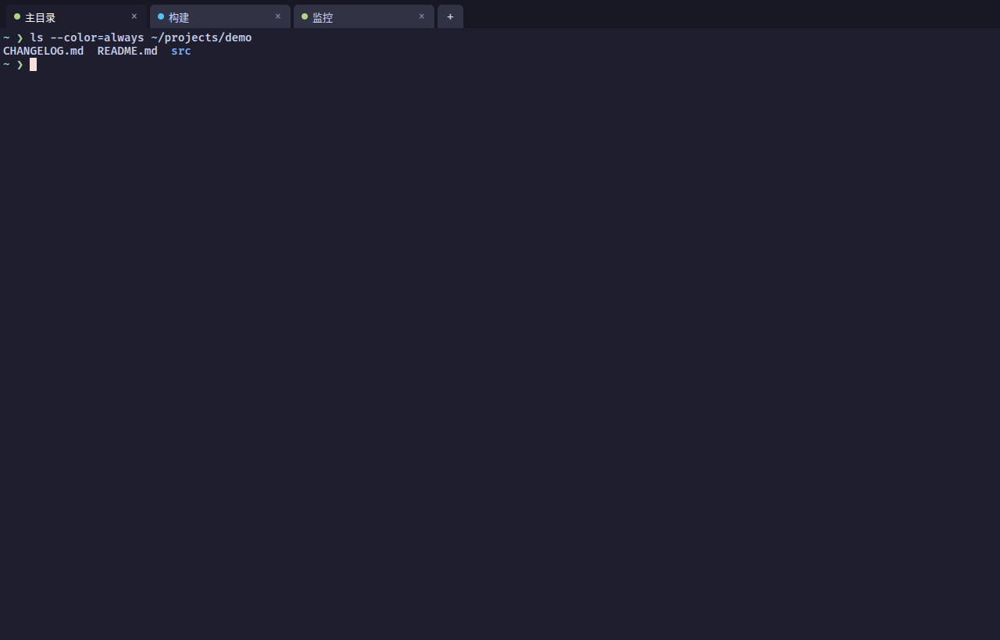
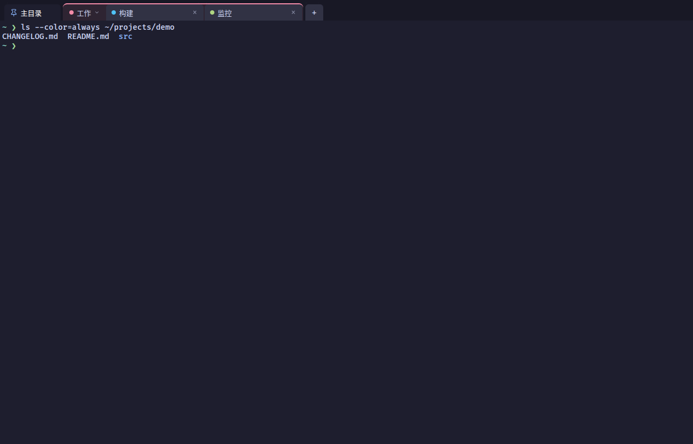
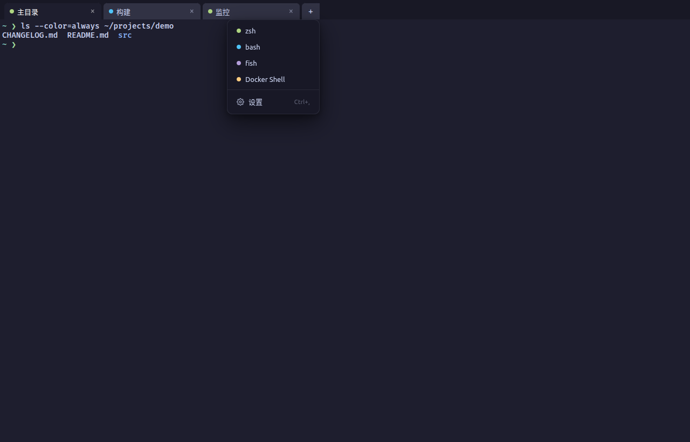
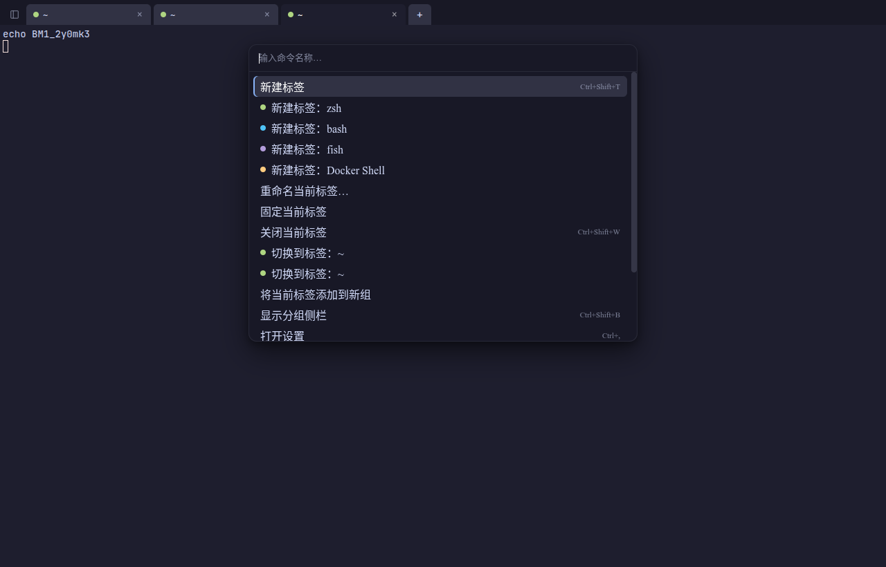
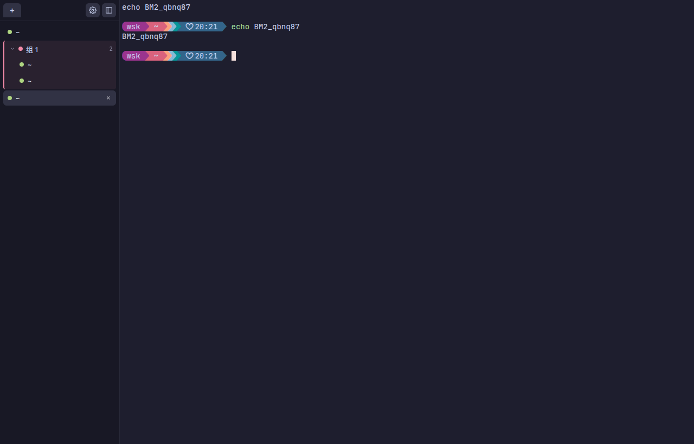
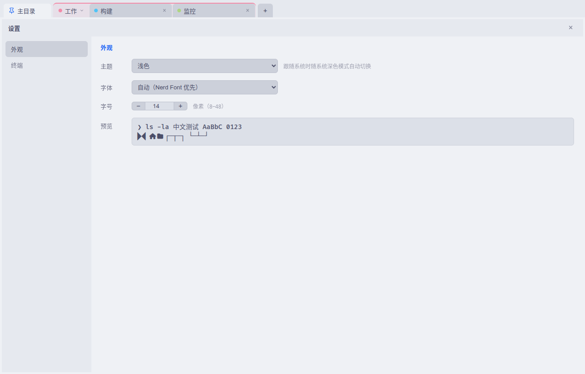

# Term Manager

[](https://github.com/wskgithub/term-manager/actions/workflows/ci.yml)
[](LICENSE)
[](https://github.com/wskgithub/term-manager/releases)

[简体中文](README.zh-CN.md) | **English**

A tabbed terminal manager for the Linux desktop: multiple tabs, renaming, drag-and-drop
reordering and multiple profiles (positioned much like Windows Terminal). The manager owns
the tab/profile/process lifecycle; terminal emulation is [xterm.js](https://github.com/xtermjs/xterm.js)
(the component behind VS Code); PTY sessions are hosted by a **tmux Control Mode backend** —
the same architecture as WindTerm/iTerm2, which makes session persistence a natural fit.

## Screenshots



 



 

All screenshots are produced by the E2E infrastructure driving the real UI (CDP menu
clicks, renames, pasted commands) — not staged mockups.

## Tech stack

- Electron 44 + TypeScript (main process owns backend/config, renderer owns UI)
- Vite (electron-vite) + React
- `@xterm/xterm` as the emulation component
- Backend: `tmux -C` control mode (private socket, one tmux window per tab; input via
  `send-keys`, output via the `%output` event stream)
- Profiles are stored as JSON (`~/.config/term-manager/profiles.json`, generated on first
  launch); app settings live in `settings.json` in the same directory

## Profile model

The `+` dropdown mimics Windows Terminal: it lists **shell types** (bash, zsh, fish, pwsh,
Docker Shell), not machines. On first launch the main process probes candidates along
`PATH` (the login shell `$SHELL` comes first); shells that are not installed are removed
from the menu. `profiles.json` (`{ "version": 2, "profiles": [...] }`) accepts any custom
profile you add, for example an ssh remote:

```json
{
  "version": 2,
  "profiles": [
    { "id": "gpu-27", "name": "GPU box", "command": "ssh", "args": ["user@192.168.1.100"], "color": "#aed581" }
  ]
}
```

Legacy v1 configs (no `version` field) are detected and regenerated with default shells.

## Settings

Open via the settings entry at the bottom of the `+` dropdown, or `Ctrl+,` (layout follows
Windows Terminal: category navigation on the left — "Appearance" and "Terminal"):

- **Theme**: dark / light / follow-system, applied live (including the native title bar —
  on X11 it follows instantly via `_GTK_THEME_VARIANT`). Two additional selects pick the
  color scheme for each side (see [Custom themes](#custom-themes) below).
- **Font**: dropdown of local monospace fonts (enumerated by the main process via
  `fc-list :mono`). The default "auto" is a Nerd-Font-first stack
  (`JetBrainsMono Nerd Font` → `FiraCode Nerd Font` → … → CJK monospace fallback);
  choosing a Latin-only font automatically appends a CJK fallback.
- **Font size**: 8–48 px, stepper or direct input.
- **Group sidebar** (Appearance page): show the "group → tab" tree panel on the left
  (replacing the top tab bar; **off by default**, toggle any time with `Ctrl+Shift+B` —
  see [Group sidebar](#group-sidebar) below).
- **Session** (Terminal page): the "keep sessions on exit" toggle (on by default, see
  [Session persistence](#session-persistence) below).
- **Group broadcast** (Terminal page): the "broadcast input to group" toggle
  (**off by default**, see [Group broadcast](#group-broadcast) below).
- **OSC 52 clipboard** (Terminal page): the "terminal programs may write the clipboard"
  toggle (on by default, see [Clickable links & OSC 52 clipboard](#clickable-links--osc-52-clipboard)
  below).
- **AI Agent** (AI Agent page): detection status and visibility for the built-in agent
  list, plus custom agent entries (see [AI Agent launching](#ai-agent-launching-auto-discovery)
  below).

Changes apply immediately to all open terminals and persist to `settings.json`.

## Custom themes

Beyond the built-in Catppuccin Mocha/Latte pair, color schemes are plain data files: drop
a JSON into `~/.config/term-manager/themes/` and it appears in the settings page (the
directory is created on first launch). The mode setting (dark/light/follow-system) stays
as-is; **Dark scheme / Light scheme** selects independently pick what each side uses —
follow-system switches between the two.

```json
{
  "name": "Gruvbox Dark",
  "type": "dark",
  "ui": { "bg": "#282828", "accent": "#b8bb26" },
  "terminal": { "background": "#282828", "foreground": "#ebdbb2", "green": "#98971a" }
}
```

- `type` declares which side the scheme belongs to (drives which select lists it).
- `ui` overrides the whitelisted CSS variables (17 keys — the app chrome palette);
  values are `#hex` or `rgba()` only. `terminal` overrides the xterm palette
  (background/foreground/cursor/selection + 16 ANSI colors).
- Any field you don't declare **inherits from the built-in scheme of that side** (the
  terminal palette is explicitly merged onto builtins — undeclared ANSI colors keep the
  Catppuccin values rather than falling back to xterm defaults).
- The filename (without `.json`) becomes the scheme id; `mocha`/`latte` are reserved.
  Bad JSON files are skipped, invalid color fields are dropped individually (with a log),
  never taking the app down. Selecting a scheme whose file later disappears falls back
  to the built-in side automatically.
- Files are re-scanned whenever the settings page or command palette opens — edit or add
  themes while running, no restart needed. Pure local data: no code execution, no network.

## Declarative plugins

Plugins are **data, not code**: a folder with a `manifest.json` under
`~/.config/term-manager/plugins/` contributes profiles, command-palette entries and theme
packs. Zero code execution, zero network — installing a plugin means trusting the content
it declares (a `launch` action runs only when you trigger it yourself by name). A plugin
is active while its folder exists; delete the folder to remove it.

```
plugins/docker-tools/
├─ manifest.json
└─ themes/night.json        # optional theme pack (same format as global themes)
```

```json
{
  "id": "docker-tools",
  "name": "Docker 工具",
  "version": "1.0.0",
  "profiles": [
    { "id": "shell", "name": "Docker Shell", "command": "docker",
      "args": ["run", "--rm", "-it", "alpine", "/bin/sh"], "color": "#ffcc80" }
  ],
  "commands": [
    { "id": "prune", "label": "Docker：清理", "keywords": "docker prune",
      "action": { "type": "launch", "profile": "shell" } },
    { "id": "open-set", "label": "打开设置", "action": { "type": "open-settings" } }
  ]
}
```

- **profiles** appear in the `+` menu / sidebar / palette (and can be set as the default
  terminal). Ids are namespaced to `plugin-id:local-id`, availability probed on PATH like
  any profile. The renderer never sends command bodies over IPC — `term:create` only
  accepts ids resolved main-side.
- **commands** are palette entries with a closed action vocabulary: `launch(profile)` /
  `open-settings` / `toggle-sidebar` / `set-theme(mode)` / `set-scheme(id)`. `launch`
  referencing a non-existent profile of the same plugin drops the command; a `set-scheme`
  id that no longer exists grays the entry out.
- **theme packs**: `themes/*.json` inside the plugin folder use the same format as global
  themes, with namespaced ids (`docker-tools/night`) selectable in the scheme selects.
- Validation follows the profiles.json culture: bad manifests are skipped, bad entries
  dropped individually with a log; duplicate plugin ids keep the first (directory order).
  The directory is re-scanned whenever the palette, `+` menu or settings page opens.
- Deliberately **no marketplace, no updater, no telemetry**: the app itself never makes
  network connections (renderer CSP enforces it). Distribution is a git clone or a
  downloaded folder. A marketplace, if ever wanted, is expected to be built *as a plugin*
  by the ecosystem — that tier of the roadmap comes with an isolated, permission-declaring
  plugin host and is not part of this declarative stage.

Writing your own plugin? The complete author reference — manifest fields, validation
rules, the theme format, the code-level API, limits and debugging — lives in
**[docs/plugins.md](docs/plugins.md)**, with copyable examples in
[docs/examples/declarative-plugin/](docs/examples/declarative-plugin/) and
[docs/examples/code-plugin/](docs/examples/code-plugin/).

## Code-level plugins (isolated host)

Declarative plugins cover *data-shaped* extensions. When you need **behavior** (watching
output, automated actions, status-bar display), add an `"entry"` to the manifest and the
plugin ships code:

```
plugins/my-tools/
├─ manifest.json      { "id": "my-tools", "name": "My Tools", "entry": "main.mjs" }
└─ main.mjs           entry script (ES module; may relatively import other files in the plugin folder)
```

Every code plugin runs in its own **sandboxed iframe** (`tmplug://<plugin-id>/` gives each
plugin a unique origin): the browser sandbox keeps it away from the UI DOM and
`window.api`; the only channel is the postMessage bridge the app sets up — and the
`termManager` API exposed over it is the entire capability surface:

```js
// main.mjs (runs inside the plugin's own sandboxed frame)
const tm = termManager.init('my-tools')

tm.registerCommand({
  id: 'ping',
  label: 'My Tools: Ping',
  run: () => tm.statusbar.setItem('ping', { text: 'pong' })
})
tm.registerTheme({ id: 'midnight', name: 'Midnight', type: 'dark', terminal: { background: '#0b0d12' } })
tm.on('tab-created', async (e) => console.log('new tab', e.id))
tm.statusbar.setItem('clock', { text: '⏳', onClick: () => tm.tabs.create() })
```

API surface (v1; full types in `src/shared/types.ts`, `TmScopedApi`). Under the isolated
host the API travels over RPC: methods that return values (`registerCommand` /
`registerTheme` / `tabs.list` / `tabs.active`) resolve **Promises**; everything else
keeps its semantics:

| Group | Capability |
| --- | --- |
| Commands | `registerCommand` / `unregisterCommand` (palette entries, key `code:plugin-id:cmd-id`) |
| Themes | `registerTheme` / `unregisterTheme` (dynamic color schemes, ids namespaced `plugin-id/local-id`, validated like theme files) |
| Events | `on('tab-created' / 'tab-closed' / 'tab-activated' / 'tab-renamed' / 'theme-changed' / 'scheme-changed', cb)` returning an unsubscribe |
| Tabs | `tabs.list() / active() / activate(id) / create(profileId?, cwd?)` |
| UI | `ui.setTheme(mode) / setScheme(id) / toggleSidebar() / openSettings()` (same vocabulary as manifest actions) |
| Terminals | `terminals.subscribe(id, cb)` (live output stream, no historical replay) and `terminals.write(id, data)` (input injection, straight to tmux, no broadcast fan-out) |
| Status bar | `statusbar.setItem(itemId, { text, color?, tooltip?, onClick? } | null)` — the bottom status bar only appears while a plugin item exists |

**Declared network permissions**: the per-plugin CSP starts at zero network. Origins that
are *declared in the manifest* and *approved by the user* are the only ones let into the
plugin frame's `connect-src`:

```json
{ "id": "my-tools", "entry": "main.mjs",
  "permissions": { "connect": ["https://api.github.com"] } }
```

- Origin rules: `https://` any host, or `http://localhost` / `http://127.0.0.1`
  (scheme://host[:port], no path); at most 8 per plugin. The first load after declaring
  shows an approval dialog (allow / deny; Esc counts as deny).
- Decisions persist in `userData/plugin-permissions.json`. **Changing the declared list
  re-prompts** — an old approval never covers new addresses.
- Denying does not block the plugin: the code runs normally, just without network.

- **Refresh/unload semantics**: loaded at startup; the palette / `+` menu / settings page
  trigger rescans — new plugins mount on the fly, and a deleted plugin's registrations
  (commands/themes/status items/subscriptions) **and its sandbox frame are destroyed
  together** (under the isolated host, plugins truly unload). Putting the folder back
  with a bumped version rebuilds the frame and re-executes it.
- The entry is validated main-side: relative path, `.js`/`.mjs`, ≤1 MB. `tmplug://` only
  serves allowlisted file types inside the plugin folder (js/mjs/css/json/png/svg) plus
  two synthesized resources (the frame host page / the frame bridge), with path traversal
  doubly rejected (`..` segment check + resolved-prefix containment).

**Security model (read before installing)** — the Tier 2 isolated host:

- **Sandbox isolation**: plugin frames are `sandbox="allow-scripts allow-same-origin"`
  and cross-origin to the app page (unique `tmplug://` origin per plugin) — the DOM,
  `window.api` and the app's localStorage are all unreachable; only data and callback
  tokens cross the bridge. `termManager` is the sole capability surface.
- **Zero network by default, declared opt-in**: per-plugin CSP `default-src 'none'`,
  `connect-src` limited to user-approved origins; the app page's own CSP remains
  `connect-src 'none'` as a technical guarantee.
- **Writing to a terminal = shell command injection**: `terminals.write` can silently
  inject input into an existing terminal, and shells have network access. Granting
  network permission and allowing terminal writes are two stacking grants of trust —
  do not install code plugins you do not trust.
- A plugin gets storage on its own origin (localStorage is per-plugin; uninstalling and
  reinstalling starts clean); errors inside plugin frames are forwarded to the host
  console (reachable via `--remote-debugging-port`).

A complete, copyable example lives at [`docs/examples/code-plugin/`](docs/examples/code-plugin/);
the full API walkthrough, limits and debugging notes are in the
[plugin development guide](docs/plugins.md).

**Managing installed plugins** — Settings → *Plugins*: every installed plugin appears as
a card (name, version, declarative / code-level type) with an **enable toggle** —
disabling immediately removes all of its contributions (profiles, commands, themes) and
destroys its sandbox frame; the state persists across restarts (`plugin-state.json`).
Code-level plugins that declared network permissions list each origin with its granted
state, plus a **re-ask** button that clears the stored decision and re-shows the
approval dialog (deny keeps the plugin at zero network). The plugins directory path is
shown with an open-directory button; folder add/remove remains the install/uninstall
semantic.

## Session persistence

Closing the window keeps the tmux sessions alive by default: running jobs (builds, ssh,
training) and terminal state survive, and the next launch restores all tabs — including
pin/group/manual-rename/active-tab state and **screen replay** (`capture-pane -e`
colored history + cursor repositioning, exact for both shell prompts and full-screen
apps like vim/htop). Crashes are recoverable the same way: session state is persisted on
every change (`sessions.json`) and windows are reconciled/adopted on restart.

- The settings page (Terminal → Session) can turn this off to return to
  "exit terminates everything"
- `Ctrl+Shift+Q` explicitly terminates all sessions and exits at any time
- Restored terminals remain fully interactive (not a read-only snapshot); tabs whose
  shell had already exited are not restored

## Group broadcast

When operating many machines at once (e.g. running the same command across a cluster),
a tab group can be set to **synchronize keyboard input** (paste included) across all of
its terminals: light up the broadcast toggle on the group head (or use the group
context menu's "Broadcast input to group"), and whatever is typed into any tab of that
group is delivered to every tab in it. Groups are user-defined logical sets, not tied
to window layout — more flexible than Terminator's split-pane-bound broadcast groups.

Mistakenly broadcasting is expensive (a password or `rm` hitting several machines at
once), so the design is deliberately defensive:

- A master toggle in Settings (Terminal → Group broadcast), **off by default**; no
  broadcast UI exists until it is enabled
- Broadcast state is **not kept across restarts** — relaunching always resets it to
  off, so it can never be silently left on
- While broadcasting it is always visible: the group-head toggle lights up in warning
  color, the group container deepens, and a persistent "broadcasting to N terminals"
  badge sits in the top-right of the terminal area whenever the active tab belongs to
  a broadcasting group

## Group sidebar

With many tabs the horizontal tab bar runs out of room. The **group sidebar** (Settings →
Appearance, off by default; `Ctrl+Shift+B` or the button at the left edge of the tab bar
toggles it) replaces the tab bar with a vertical tree panel: pinned tabs on top, groups
as collapsible tree nodes (colored dot, name, member count), ungrouped tabs at the root
level — same order as the tab bar, just vertical.

- Full management parity with the tab bar: click to switch, double-click to rename,
  right-click context menus (pin/group/move/close, rename/recolor/dissolve/broadcast),
  `+` new-tab dropdown and settings entry in the sidebar header
- **Tree drag-and-drop**: reorder within the same parent, drop a tab onto a group node
  to join it, drop a group member onto an ungrouped row to leave it (the pin/group
  ordering invariants are maintained centrally by the app state)
- The terminal area is re-fit live when the sidebar opens/closes (tmux panes are
  resized accordingly); group collapse state is shared with the tab bar and persists
  across restarts with the session

## Command palette

`Ctrl+Shift+P` opens a VS Code-style top-center palette (works whether focus is in a
terminal or not). Fuzzy search (subsequence matching with hit highlighting; Chinese
commands also match their English keywords), ↑↓ to select, Enter to run, Esc to close
and hand focus back to the terminal. Four command families:

- **Tab actions**: new tab (default + one entry per profile, with color dots), rename
  the current tab (a second input step inside the palette, Enter commits), pin/unpin,
  close (grayed out on pinned tabs — same anti-misclick semantics as the shortcut)
- **Quick tab switching**: "switch to tab: <title>" — one entry per tab (with
  pin/group markers), so the palette doubles as a tab switcher, faster than Ctrl+Tab
  cycling once tabs pile up
- **Grouping & broadcast**: add to a new group, leave the group, broadcast toggle
  (gated by the master settings switch; the enabling action is shown in warning color)
- **App-level**: sidebar toggle, settings page, theme switching (current theme grayed
  out and marked), quit and terminate all sessions (warning color)

Every command maps onto existing app callbacks (no new IPC or data flow);
context-sensitive entries appear and flip with state (e.g. "leave group" only exists
inside a group; close grays out once pinned).

## Terminal search

`Ctrl+Shift+F` opens a find bar for the active terminal's buffer — scrollback included,
not just the visible screen. Type to search as you go: every match is highlighted, the
active one stronger, with an `i/n` counter. `Enter` / `Shift+Enter` jump to the next /
previous match (the viewport scrolls into scrollback as needed), `Esc` closes and hands
focus back to the terminal. Three toggles cover case-sensitive, whole-word and regex
matching. While the bar is open it always acts on the *active* tab: switching tabs with
`Ctrl+Tab` re-runs the search on the new terminal; reopening later pre-fills the last
query.

The shortcut is deliberately `Ctrl+Shift+F` (terminal-emulator convention: GNOME
Terminal, Konsole), not `Ctrl+F` — plain `Ctrl+F` is the readline forward-char binding
and keeps reaching the shell untouched.

## Clickable links & OSC 52 clipboard

URLs printed by programs (build logs, error messages, `git` output…) are detected and
become clickable: hover underlines the link, a click hands it to the system browser via
the main process — the same http/https-only whitelist that governs `window.open`
(`file://` and other schemes are refused, non-http OSC 8 links are filtered out by the
terminal core before activation). Explicit OSC 8 hyperlinks (emitted by modern CLIs
like `gh`, `jq --argjson` helpers or CI tooling) work the same way.

OSC 52 lets *terminal programs* write the system clipboard — the main path for copying
from SSH remotes: run `vim`/`tmux copy-mode`/`wl-copy`-style tools on the remote host
and the text lands in your local clipboard, no X forwarding needed. It works with zero
tmux configuration: the tmux control-mode `%output` stream is a pre-parser tap of the
pane's raw bytes, so the escape sequence reaches this app's xterm parser no matter what
the remote or the tmux server does with it. Limits: payloads decode-capped at 1 MB per
write, and the read direction (the `?` query) is never answered — your clipboard never
flows out to a program. A settings toggle (Terminal page, on by default) disables the
whole pathway.

## Split panes

`Ctrl+Shift+D` splits the active pane side by side, `Ctrl+Shift+E` stacks it (iTerm
convention; both nest freely). The new pane runs the same profile as its tab and
inherits the source pane's working directory, and gets the focus. Move between panes
with `Ctrl+Alt+Arrow keys` or by clicking; the focused pane is outlined. `Ctrl+Shift+W`
degrades gracefully: with multiple panes it closes the active pane (survivors stretch
to fill the gap, even on pinned tabs — pinning protects the tab, not the pane), with a
single pane it closes the tab as before. Drag a separator to resize: the layout is
recomputed by tmux and pushed back to every pane.

The tmux server is the single source of truth for pane geometry — the renderer acts
as its client: it only reports the overall window size, and pane rectangles arrive via
the control-mode `%layout-change` notification (reconciled through `list-panes`, which
is also how pane death is detected on tmux 3.2a, which has no pane-died notification).
Splits therefore survive session keep-and-restore: the layout is rebuilt from tmux
state on attach, panes included.

`Ctrl+Shift+Enter` zooms the active pane to fill the whole tab (tmux `resize-pane -Z`);
the same shortcut zooms back out — the layout is restored to the exact geometry it had
before. The hidden panes stay alive with their buffers intact, and zoom state lives in
the tmux server, so it survives session keep-and-restore too. Navigating away
(`Ctrl+Alt+Arrow keys`), splitting, or closing the zoomed pane zooms out automatically
(tmux semantics); a small badge in the corner reminds you that you are zoomed and how
to leave.

## GPU rendering

Terminals render through the WebGL renderer (`@xterm/addon-webgl`) by default —
fast output and large-scrollback scrolling are noticeably smoother than with the DOM
renderer; glyphs live on the GPU in a texture atlas instead of per-frame DOM layout.
Works out of the box, nothing to configure:

- **Automatic fallback**: if the WebGL context cannot be created (driver unsupported /
  disabled by the environment) or is lost at runtime (GPU reset, or the browser's
  context-count limit), the terminal falls back to the DOM renderer with no functional
  impact; when tabs exceed the context limit the oldest terminals degrade one by one
  and self-heal — no crash
- **Settings toggle** (Terminal → Rendering): off forces the DOM renderer everywhere;
  the switch applies live without recreating open terminals (terminals created
  afterwards follow the new setting)
- The cost: one WebGL context + glyph atlas per terminal, a modest memory increase
  (measured ~+200MB with 20 tabs); constrained machines can turn it off

## AI Agent launching (auto-discovery)

Right-click any terminal pane and the "Launch AI Agent" submenu lists the AI Agent CLIs
discovered on this machine (Claude Code, Codex, OpenCode, CodeBuddy, Gemini CLI,
Qwen Code, Aider, Crush, iFlow CLI). Clicking one opens a new tab running that agent
**in the pane's current working directory**; the tab closes when the agent exits, the
same lifecycle as any other tab.

- **Discovery**: probes `$PATH` plus common global bin dirs (`~/.local/bin`,
  `~/.npm-global/bin`, `~/.bun/bin`, `~/.volta/bin`), re-checked every time the menu
  opens (newly installed agents appear without a restart). Launching uses the resolved
  absolute path, so "visible in the menu" always means "launchable" even when the
  desktop session's PATH is narrower than your shell's. The built-in registry
  (`src/shared/agents.json`) is also the data source for the Nautilus extension.
- **Settings → AI Agent**: per-agent detection status with visibility checkboxes, plus
  custom agent entries (name + command with args; the command charset is whitelisted,
  no shell metacharacters). Custom entries appear in both the in-app submenu and the
  Nautilus right-click submenu.
- **Fallback**: if the binary can no longer be resolved at click time (just uninstalled
  / PATH changed), a plain terminal tab opens in that directory instead and a desktop
  notification explains why — the click is never silently lost.

## Nautilus context-menu integration

The file manager's right-click menu (on a directory or in the empty area of a directory)
offers "Open in Term Manager" as a parent item with a submenu (shaped like the built-in
"New Document" entry): the first child "Open terminal tab" opens a tab in that directory,
and below it the discovered AI Agent CLIs launch in that directory directly. When the app
is already running the existing window is reused and focused (single instance); the
command line also accepts `term-manager --open-dir=<dir>` (or `term-manager <dir>`),
paired with `--agent=<id>` to launch a specific agent (the Nautilus submenu uses exactly
this path).

- The deb installs the extension to
  `/usr/share/nautilus-python/extensions/term_manager_nautilus.py` together with the
  agent registry `term-manager-agents.json` (same bytes as `src/shared/agents.json`),
  and Recommends `python3-nautilus`: `apt install ./*.deb` pulls it in automatically, `dpkg -i` needs a
  manual `sudo apt install python3-nautilus`. The rpm carries the same files (install
  `python3-nautilus` manually — rpm has no Recommends here); the AppImage does not include
  it. Without that dependency the extension
  silently does nothing (the app itself is unaffected).
- After installing, run `nautilus -q` (or log out/in) so the file manager reloads
  extensions.
- For debugging, point the environment variable `TERM_MANAGER_BIN` at a local build.

## Directory layout

```
src/
├── main/            # Electron main process
│   ├── index.ts     # entry, window, IPC, smoke/E2E orchestration
│   ├── tmux.ts      # tmux Control Mode backend (session hosting / input / output / resize / attach & replay)
│   ├── profiles.ts  # profile registry (JSON persistence)
│   ├── settings.ts  # app settings (font/size) + fc-list font enumeration
│   ├── themes.ts    # color-scheme directory loader (themes/*.json, read-only; validation shared in shared/themes.ts)
│   ├── plugins.ts   # plugin registry (plugins/*/manifest.json; incl. L3 entry validation)
│   └── session.ts   # session persistence (sessions.json: attach candidate + tab metadata)
├── preload/         # contextBridge API
└── renderer/src/
    ├── App.tsx      # tab state machine + single-point data fan-out + hotkeys + settings state
    ├── TabBar.tsx   # rename / drag reorder / profile menu / settings entry
    ├── Sidebar.tsx  # group sidebar tree view (replaces the tab bar when enabled)
    ├── NewTabMenu.tsx # + split button / profile dropdown (shared by tab bar & sidebar)
    ├── palette.ts   # command palette registry (command building + fuzzy match scoring)
    ├── CommandPalette.tsx # command palette overlay (keyboard nav + two-step rename)
    ├── menus.tsx    # shared tab/group context-menu builders (data-key is the e2e selector)
    ├── segs.ts      # tab-list segmentation (consecutive same-group runs), shared view model
    ├── TermView.tsx # xterm instances (single-point output dispatch, adaptive sizing, font settings)
    ├── PaneLayout.tsx # per-tab pane layout: tmux-authoritative geometry → pixel rects, grip drag, window-size reporting
    ├── TermSearch.tsx # terminal find bar (Ctrl+Shift+F: decorations, counter, case/word/regex toggles)
    ├── SettingsPage.tsx # settings page (appearance → font/size + preview; terminal → defaults)
    ├── fonts.ts     # font stack resolution (auto mode / CJK fallback)
    ├── pluginHost.ts # code-level plugin host (sandboxed iframes + postMessage RPC server / registries / event fan-out)
    ├── PluginPermissionModal.tsx # network-permission approval dialog (allow / deny, Esc = deny)
    ├── PluginManager.tsx # settings "Plugins" section: cards with enable toggle + permission view/re-ask
    └── e2e.ts       # E2E driving hooks
```

## Common commands

```bash
npm run dev        # development mode (hot reload)
npm run build      # build to out/
npm run typecheck  # TS checks (node + web projects)
npm run smoke      # windowless smoke: real shell echo round-trip validates the backend path
npm run rebuild    # rebuild native modules (currently none — no-op)
npm run dist       # build all three packages: deb + AppImage + rpm into dist/
npm run dist:dir   # produce dist/linux-unpacked/ only (no package, quick content check)
```

## Linux packaging (deb / AppImage / rpm)

```bash
npm run dist        # dist/term-manager_<version>_amd64.deb, term-manager-<version>.AppImage,
                    # term-manager-<version>.x86_64.rpm
```

### deb (Ubuntu / Debian)

```bash
sudo dpkg -i dist/term-manager_*.deb   # install (into /opt + /usr/bin link + desktop entry)
sudo dpkg -r term-manager              # uninstall
```

- Configuration lives in the `build` field of `package.json` (electron-builder 26).
- Layout: the app installs to `/opt/term-manager/`; postinst creates `/usr/bin/term-manager`
  (update-alternatives), handles chrome-sandbox permissions (SUID when no user namespaces),
  registers desktop databases; Ubuntu 24+ also installs an apparmor profile.
- Desktop entry `/usr/share/applications/term-manager.desktop` (Name=Term Manager,
  Categories=Utility;TerminalEmulator) with hicolor icons 24x24…512x512 (source:
  `build/icons/`, generated once by script).
- `Depends` always includes **tmux** besides the Electron runtime libraries.
- The Electron binary is taken directly from `node_modules/electron/dist` (`electronDist`)
  instead of being downloaded again; fpm and friends are fetched through
  `ELECTRON_BUILDER_BINARIES_MIRROR` (npmmirror), cached under `.cache/` (gitignored).
- Window association verified: `desktopName` ships inside the asar and Electron derives the
  app_id from it; `xprop WM_CLASS` reports `"term-manager", "Term-manager"`, matching
  `StartupWMClass`.

### AppImage (portable, no install)

```bash
chmod +x dist/term-manager-*.AppImage
./dist/term-manager-*.AppImage            # needs FUSE (libfuse2) — or, without it:
./dist/term-manager-*.AppImage --appimage-extract-and-run
```

- Self-contained single file: no root, no install, runs from anywhere; delete to remove.
- **tmux is not a packaged dependency** — install it yourself (`apt install tmux` /
  `dnf install tmux`); the app shows an error banner if it is missing.
- On systems that restrict unprivileged user namespaces (e.g. Ubuntu 24.04's AppArmor
  restrictions) the Chromium sandbox may fail inside a squashfs mount — the AppImage then
  needs `--no-sandbox`, or use the deb/rpm which set up chrome-sandbox properly.
- The Nautilus context-menu extension is not included (AppImages never write into system
  directories); the deb/rpm carry it.

### rpm (Fedora / RHEL family)

```bash
sudo dnf install dist/term-manager-*.rpm
sudo dnf remove term-manager
```

- `Requires` covers the Electron runtime libraries plus **tmux**, using Fedora-family
  package names (`gtk3`, `nss`, `libXScrnSaver`, …). Other rpm distros (e.g. openSUSE)
  name some libraries differently — best effort, not tested there.
- The Nautilus extension is installed to the same path, but rpm has no `Recommends` here —
  install `python3-nautilus` manually if you want the file-manager integration.

## E2E tests

```bash
# 20-tab end-to-end: batch create → per-tab echo latency → screenshots → keyboard
# injection → performance summary → auto-quit
npx electron out/main/index.js --e2e-tabs=20 --e2e-out=/tmp/e2e --e2e-quit --no-sandbox
```

Watch the `E2E_RESULT` log line; screenshots land in `--e2e-out` (boot/tabs5/all-tabs/
after-typing). Add `--e2e-settings` to also open the settings page and capture
`05-settings.png`.

```bash
# AI Agent launch regression: CLI cold-start queueing (--open-dir + --agent) → submenu
# visibility and keyboard navigation (→ opens, Esc closes the submenu first) →
# click-to-launch (cwd = the right-clicked pane's real working directory) → the settings
# hide toggle and custom-agent flow end to end → hot delivery and unresolved-agent
# fallback. The fixture is a fake agent on a prepended PATH dir; assertions never
# depend on what is actually installed on the machine
npx electron out/main/index.js --e2e-agents --open-dir=/tmp/e2e-agents-ud --agent=c-fake --e2e-quit --no-sandbox
```

```bash
# Real input-path regression: sendInputEvent trusted events — focus lands in the
# terminal after a real tab click, Ctrl+Tab switches without leaking \t into the shell,
# high-volume CJK text shows no mojibake, and group broadcast behaves (settings-gated
# UI, delivery to both group panes but not outsiders, independence restored when off)
npx electron out/main/index.js --e2e-input --e2e-quit --no-sandbox
```

```bash
# Session-persistence two-phase regression (isolated userData; two processes simulate
# an app restart). Phase 1 creates tabs + pin + group + rename + a marker string, then
# exits keeping the session; phase 2 re-attaches and asserts tabs/pin/group/rename/
# screen replay/interactivity, then terminates and cleans up.
U=/tmp/e2e-sess-ud; rm -rf $U; mkdir -p $U
M=$(npx electron out/main/index.js --e2e-session=phase1 --e2e-user-data=$U --no-sandbox 2>&1 \
  | grep -oE 'E2E_SESS1_MARKER [A-Za-z0-9_]+' | cut -d' ' -f2)
npx electron out/main/index.js --e2e-session=phase2 --e2e-user-data=$U --e2e-sess-marker=$M --no-sandbox
```

```bash
# Group sidebar regression: all three toggle paths (tab-bar button / sidebar close /
# Ctrl+Shift+B through the real input pipeline), tree structure vs the tab array,
# menu-driven grouping + rename, synthetic-drag into/out-of-group and same-parent
# reorder, collapse, click-to-activate focus ownership, live terminal re-fit on toggle
npx electron out/main/index.js --e2e-sidebar --e2e-quit --no-sandbox
```

```bash
# Command palette regression: Ctrl+Shift+P through the real input pipeline (including
# xterm penetration while a terminal has focus), fuzzy filtering, arrow/Enter/mouse
# execution, two-step rename, context-sensitive commands (close grayed on pinned tabs,
# broadcast gated by settings, current theme grayed), Esc close and focus return
npx electron out/main/index.js --e2e-palette --e2e-quit --no-sandbox
```

```bash
# Terminal search regression: Ctrl+Shift+F through the real input pipeline (terminal
# focused, focus elsewhere, refocus-while-open), match counter and Enter/Shift+Enter
# navigation, matches seeded into scrollback with viewport jumps, case/regex toggles,
# no-match wording, Esc close with focus returned to the shell, last-query prefill on
# reopen, re-run on Ctrl+Tab while the bar is open, typing never leaks into the shell
npx electron out/main/index.js --e2e-search --e2e-quit --no-sandbox
```

```bash
# Split-pane regression: Ctrl+Shift+D/E through the real input pipeline (nesting
# included), tmux-authoritative geometry vs xterm measured cols, new-pane focus,
# Ctrl+Alt+Arrow navigation and click-to-focus (arrow keys driven via the CDP debugger
# — sendInputEvent emits them with an empty key/code), typing lands in the focused
# pane only, Ctrl+Shift+W semantics (close pane / collapse / pinned-tab guard),
# separator drag-resize with row conservation, tab close cascades to every pane
npx electron out/main/index.js --e2e-splits --e2e-quit --no-sandbox
```

```bash
# Pane-zoom regression: Ctrl+Shift+Enter toggle path (TermView interception),
# full-tab geometry and input delivery, focus retention, zoom kept across tab
# switches, exact layout restore on zoom-out, Ctrl+Alt+Arrow navigation
# auto-unzooming (tmux select-pane semantics), closing the zoomed pane, single-pane
# guard
npx electron out/main/index.js --e2e-zoom --e2e-quit --no-sandbox
```

```bash
# Links & OSC 52 regression: real full-path OSC 52 writes (printf → pane output →
# %output → xterm parser → clipboard IPC, asserted by reading the clipboard in the
# main process), UTF-8 payloads, sequence not landing in the buffer, the 1 MB cap,
# the '?' read query never answered, the settings toggle via a real settings-page
# click, and real mouse-driven link clicks (URL detection + OSC 8, non-http refused
# both ways; the openExternal handler is swapped in-main so no browser launches)
npx electron out/main/index.js --e2e-links --e2e-quit --no-sandbox
```

```bash
# Profile runtime-refresh regression (self-contained env: isolated userData + an empty
# "install dir" on PATH). Writing/removing a fake shell simulates install/uninstall;
# asserts profiles:list re-probes on every call, the renderer re-fetches when the +
# menu / command palette opens, newly installed built-in shells get merged in, and
# changes persist to profiles.json
npx electron out/main/index.js --e2e-profile-refresh --e2e-quit --no-sandbox
```

```bash
# Custom color-scheme regression (self-contained env: isolated userData with a themes/
# directory fixture — good dark/light files, broken JSON, bad color fields, a reserved
# builtin id, an illegal filename). Asserts loader drop paths, the settings-page dark/light
# scheme selects, inline CSS-variable overrides with cascade inheritance, the explicit
# partial-palette merge onto builtins (undeclared ANSI colors inherit instead of falling
# back to xterm defaults), independent dark/light switching, defensive fallback when a
# selected file is deleted (settings page rescan), and the anti-flash preapply cache
npx electron out/main/index.js --e2e-themes --e2e-quit --no-sandbox
```

```bash
# Declarative plugin regression (self-contained env: isolated userData with a plugins/
# fixture — a good plugin with profile/commands/theme-pack, broken JSON, an unknown
# action type, a duplicate id). Asserts manifest drop paths, plugin profiles in the +
# menu with real launch & echo, palette command execution (launch / open-settings),
# unknown-scheme graying, and plugin theme packs reaching the scheme selects
npx electron out/main/index.js --e2e-plugins --e2e-quit --no-sandbox
```

```bash
# Code-level plugin regression (self-contained env: a good plugin whose main.mjs covers
# the whole API surface, a syntax-error entry plugin, a declaration-only plugin).
# Asserts entry field delivery, real script execution over tmplug://, dynamic palette
# commands executing (tab created), event delivery, dynamic themes reaching the selects
# and applying, CSP blocking connections (connect-src 'none'), a broken script not
# taking down the app or sibling plugins, plus the management UI: settings-page plugin
# cards, disable toggle tearing down frame + contributions (and restoring), and
# permission re-ask tightening the frame CSP end-to-end
npx electron out/main/index.js --e2e-code-plugins --e2e-quit --no-sandbox
```

```bash
# GPU rendering regression (discriminator: the WebGL main canvas only enters the DOM
# after context creation succeeds). Normal mode asserts default-on, live settings
# toggling without recreating terminal instances, new terminals following the setting,
# and font-size/theme changes keeping the renderer; add --e2e-webgl-fallback to
# disable WebGL early in boot, deterministically triggering creation failure →
# automatic DOM fallback + leftover-layer cleanup + fully working terminals
npx electron out/main/index.js --e2e-webgl --e2e-quit --no-sandbox
npx electron out/main/index.js --e2e-webgl-fallback --e2e-quit --no-sandbox
```

### Measured performance (20 hosted tabs, 2026-09-09, i5/integrated graphics)

| Metric | Value |
|---|---|
| Echo latency (renderer → backend → zsh → renderer) | p50 ≈ 12 ms, p95 ≈ 60 ms |
| Idle CPU (all processes) | ≈ 0% |
| Memory (all processes, incl. 20×2000-line scrollback) | ≈ 540 MB (baseline 197 MB, ~17 MB/tab) |
| Stability | 20/20 tabs, 0 errors, no leftover processes on exit |

## Keyboard shortcuts

- `Ctrl+Shift+T` new tab (default profile)
- `Ctrl+Shift+W` close current tab (has no effect on pinned tabs — prevents accidental
  closes); with multiple panes in the tab it first closes the active pane instead
- `Ctrl+Tab` / `Ctrl+Shift+Tab` switch tabs (when a terminal has focus this is intercepted
  by the xterm keyboard hook; when focus is outside terminals a window-level listener is
  the fallback — the Tab family never bubbles once claimed by xterm)
- `Ctrl+Shift+Q` quit and terminate all sessions (the tmux server and its shells end)
- `Ctrl+Shift+B` toggle the group sidebar (works whether focus is in a terminal or not)
- `Ctrl+Shift+P` toggle the command palette (same; see [Command palette](#command-palette))
- `Ctrl+Shift+F` terminal buffer search, scrollback included (see
  [Terminal search](#terminal-search))
- `Ctrl+Shift+D` / `Ctrl+Shift+E` split the active pane side by side / stacked (iTerm
  convention, nests freely; see [Split panes](#split-panes))
- `Ctrl+Alt+Arrow keys` move focus between panes of the active tab
- `Ctrl+Shift+Enter` zoom the active pane to fill its tab; the same shortcut zooms out
  (see [Split panes](#split-panes))
- `Ctrl+,` toggle settings page (`Esc` or clicking a tab closes it)
- Double-click a tab to rename (after a manual rename the shell-reported title no longer
  overrides it)
- Tab right-click menu: pin/unpin (always at the left, narrow, no close button), add to a
  new group / move into an existing group / remove from group, close

## Done / roadmap

- [x] Multiple tabs, click-to-switch, close, grayed-out prompt on exit
- [x] Double-click rename (title-override semantics)
- [x] Drag-and-drop tab reordering
- [x] Profile system: the `+` menu lists local shell types (bash / zsh / fish / pwsh /
      Docker Shell, probed along PATH, unavailable ones grayed out); the default profile
      is the user's login shell; ssh remotes are user-defined profiles in profiles.json.
      Availability refreshes at runtime — opening the `+` menu or the command palette
      re-probes PATH and merges in newly installed built-in shells, no restart needed
- [x] tmux Control Mode backend: UTF-8 (StringDecoder for multi-byte characters across
      chunks), adaptive sizing, input debounce batching (5 ms/8 KB), process-failure
      fallback (a missing/killed tmux no longer crashes the main process), cleanup of
      tmux servers left behind by crashed instances on startup (socket names embed the
      creator pid for liveness probing)
- [x] Settings page (appearance: font picker / font size, fc-list monospace enumeration,
      applied live + persisted)
- [x] E2E test infrastructure (smoke + 20-tab benchmark + screenshots + keyboard
      injection + input regression [incl. broadcast routing] + two-phase
      session-persistence regression)
- [x] Pinned tabs + tab groups (colored groups in the tab bar: collapse by clicking the
      group head, right-click to rename/recolor/dissolve; pin and group are mutually exclusive)
- [x] Session persistence: exit keeps tmux sessions; relaunch re-attaches and restores
      tabs/pin/group/rename state plus screen replay (covered by `--e2e-session`)
- [x] Per-group broadcast input (tab granularity, beyond Terminator; settings toggle
      off by default, broadcast state does not survive restart, covered by `--e2e-input`)
- [x] electron-builder deb packaging (desktop entry / icons / dependency metadata included)
- [x] Nautilus context-menu integration (open-in-directory + single-instance window reuse,
      shipped with the deb / rpm)
- [x] Group sidebar tree view (vertical "group → tab" panel replacing the tab bar; tree
      drag-and-drop for reorder/join/leave, covered by `--e2e-sidebar`)
- [x] Command palette (`Ctrl+Shift+P` fuzzy search & run: tabs/profiles/switching/
      grouping/broadcast/theme/sidebar/settings/quit, in-palette two-step rename,
      covered by `--e2e-palette`)
- [x] GPU rendering (addon-webgl on by default, automatic DOM-renderer fallback on
      creation failure or context loss, settings toggle, covered by `--e2e-webgl` in
      both modes)
- [x] Custom themes (color schemes as data files in the themes directory: UI CSS
      variables + xterm palette with field-level inheritance from builtins, dark/light
      scheme selects per side, covered by `--e2e-themes`)
- [x] Declarative plugins (manifest-based profiles / palette commands / theme packs —
      zero code execution, zero network, covered by `--e2e-plugins`)
- [x] Code-level plugin API (manifest `entry`: sandboxed-iframe isolated host, one
      `tmplug://` origin per plugin, `termManager` API over a postMessage RPC bridge —
      commands / dynamic themes / events / tab control / terminal read-write / status
      bar; per-plugin CSP starts at zero network and only lets in origins that are
      declared in the manifest and approved by the user, while the app page CSP stays
      `connect-src 'none'`. `--e2e-code-plugins` covers isolation, permissions, CSP and
      unload end-to-end)
- [x] Plugin management UI (settings page: per-plugin cards with an enable toggle that
      tears down contributions + sandbox frame and persists across restarts, network
      permission view with a re-ask button, open-plugins-directory)
- [x] Terminal buffer search (`Ctrl+Shift+F`: scrollback included, all-match
      decorations with an `i/n` counter, Enter/Shift+Enter navigation, case/whole-word/
      regex toggles, re-runs on tab switch, `--e2e-search` covers the shortcut paths
      end-to-end)
- [x] Split panes (`Ctrl+Shift+D`/`E`, nests freely; new pane runs the tab's profile and
      inherits the source pane's cwd; `Ctrl+Alt+Arrows` navigation, separator drag-resize,
      graceful `Ctrl+Shift+W`; tmux is the layout authority — geometry arrives via
      `%layout-change` + `list-panes` reconciliation, which doubles as pane-death
      detection on tmux 3.2a; splits survive session keep-and-restore, covered by
      `--e2e-splits` and the session two-phase suite)
- [x] Pane zoom (`Ctrl+Shift+Enter` toggles tmux `resize-pane -Z`; zoom state survives
      session keep-and-restore; navigating/splitting/closing auto-unzooms, covered by
      `--e2e-zoom`)
- [x] Clickable links (detected URLs + OSC 8 hyperlinks open in the system browser via
      the main-process http/https whitelist, covered by `--e2e-links`)
- [x] OSC 52 clipboard (terminal programs — including anything reached over ssh — write
      the local clipboard; 1 MB cap, read direction never answered, settings toggle,
      zero tmux configuration, covered by `--e2e-links`)
- [x] AppImage and rpm package formats (deb / AppImage / rpm from one `npm run dist`)

## Notes

- The originally planned node-pty direct backend could not land because an environment
  security hook mis-flagged execvp-style spawns as "command injection"; the tmux backend
  that replaced it turned out to enable session persistence for free. The interface layer
  (TmuxBackend, isomorphic to the original PtyManager) allows both to coexist in the future.
- powerline/Nerd glyphs depend on font coverage: the default font stack prefers Nerd Fonts,
  and you can pick manually in settings; when the selected font lacks a glyph Chromium
  falls back per glyph, though a non-Nerd font may still show placeholder boxes.
