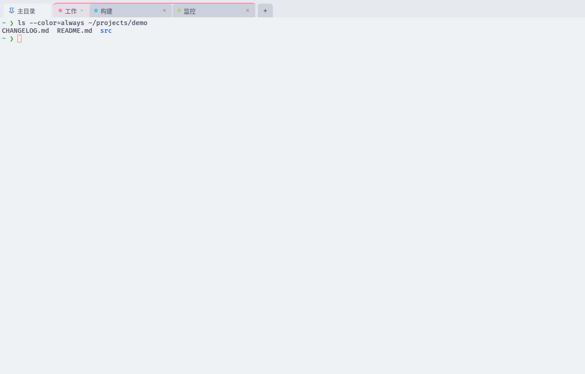

# Term Manager

[](https://github.com/wskgithub/term-manager/actions/workflows/ci.yml)
[](LICENSE)

[简体中文](README.zh-CN.md) | **English**

A tabbed terminal manager for the Linux desktop: multiple tabs, renaming, drag-and-drop
reordering and multiple profiles (positioned much like Windows Terminal). The manager owns
the tab/profile/process lifecycle; terminal emulation is [xterm.js](https://github.com/xtermjs/xterm.js)
(the component behind VS Code); PTY sessions are hosted by a **tmux Control Mode backend** —
the same architecture as WindTerm/iTerm2, which makes session persistence a natural fit.

## Screenshots


 

 

All screenshots are produced by the E2E infrastructure driving the real UI (CDP menu
clicks, renames, pasted commands) — not staged mockups.

## Tech stack

- Electron 44 + TypeScript (main process owns backend/config, renderer owns UI)
- Vite (electron-vite) + React
- `@xterm/xterm` as the emulation component
- Backend: `tmux -C` control mode (private socket, one tmux window per tab; input via
  `send-keys`, output via the `%output` event stream)
- Profiles are stored as JSON (`~/.config/term-manager/profiles.json`, generated on first
  launch); app settings live in `settings.json` in the same directory

## Profile model

The `+` dropdown mimics Windows Terminal: it lists **shell types** (bash, zsh, fish, pwsh,
Docker Shell), not machines. On first launch the main process probes candidates along
`PATH` (the login shell `$SHELL` comes first); shells that are not installed are removed
from the menu. `profiles.json` (`{ "version": 2, "profiles": [...] }`) accepts any custom
profile you add, for example an ssh remote:

```json
{
  "version": 2,
  "profiles": [
    { "id": "gpu-27", "name": "GPU box", "command": "ssh", "args": ["user@192.168.1.100"], "color": "#aed581" }
  ]
}
```

Legacy v1 configs (no `version` field) are detected and regenerated with default shells.

## Settings

Open via the settings entry at the bottom of the `+` dropdown, or `Ctrl+,` (layout follows
Windows Terminal: category navigation on the left, currently "Appearance" only):

- **Theme**: dark / light / follow-system, applied live (including the native title bar —
  on X11 it follows instantly via `_GTK_THEME_VARIANT`).
- **Font**: dropdown of local monospace fonts (enumerated by the main process via
  `fc-list :mono`). The default "auto" is a Nerd-Font-first stack
  (`JetBrainsMono Nerd Font` → `FiraCode Nerd Font` → … → CJK monospace fallback);
  choosing a Latin-only font automatically appends a CJK fallback.
- **Font size**: 8–48 px, stepper or direct input.

Changes apply immediately to all open terminals and persist to `settings.json`.

## Nautilus context-menu integration

The file manager's right-click menu (on a directory or in the empty area of a directory)
offers "Open in Term Manager": opens a tab in that directory. When the app is already
running the existing window is reused and focused (single instance); the command line
also accepts `term-manager --open-dir=<dir>` or `term-manager <dir>`.

- The deb installs the extension to
  `/usr/share/nautilus-python/extensions/term_manager_nautilus.py` and Recommends
  `python3-nautilus`: `apt install ./*.deb` pulls it in automatically, `dpkg -i` needs a
  manual `sudo apt install python3-nautilus`. Without that dependency the extension
  silently does nothing (the app itself is unaffected).
- After installing, run `nautilus -q` (or log out/in) so the file manager reloads
  extensions.
- For debugging, point the environment variable `TERM_MANAGER_BIN` at a local build.

## Directory layout

```
src/
├── main/            # Electron main process
│   ├── index.ts     # entry, window, IPC, smoke/E2E orchestration
│   ├── tmux.ts      # tmux Control Mode backend (session hosting / input / output / resize)
│   ├── profiles.ts  # profile registry (JSON persistence)
│   └── settings.ts  # app settings (font/size) + fc-list font enumeration
├── preload/         # contextBridge API
└── renderer/src/
    ├── App.tsx      # tab state machine + single-point data fan-out + hotkeys + settings state
    ├── TabBar.tsx   # rename / drag reorder / profile menu / settings entry
    ├── TermView.tsx # xterm instances (single-point output dispatch, adaptive sizing, font settings)
    ├── SettingsPage.tsx # settings page (appearance → font/size + preview)
    ├── fonts.ts     # font stack resolution (auto mode / CJK fallback)
    └── e2e.ts       # E2E driving hooks
```

## Common commands

```bash
npm run dev        # development mode (hot reload)
npm run build      # build to out/
npm run typecheck  # TS checks (node + web projects)
npm run smoke      # windowless smoke: real shell echo round-trip validates the backend path
npm run rebuild    # rebuild native modules (currently none — no-op)
npm run dist       # build the deb (dist/term-manager_<version>_amd64.deb)
npm run dist:dir   # produce dist/linux-unpacked/ only (no package, quick content check)
```

## deb packaging

```bash
npm run dist        # dist/term-manager_0.1.0_amd64.deb
sudo dpkg -i dist/term-manager_*.deb   # install (into /opt + /usr/bin link + desktop entry)
sudo dpkg -r term-manager              # uninstall
```

- Configuration lives in the `build` field of `package.json` (electron-builder 26, deb target).
- Layout: the app installs to `/opt/term-manager/`; postinst creates `/usr/bin/term-manager`
  (update-alternatives), handles chrome-sandbox permissions (SUID when no user namespaces),
  registers desktop databases; Ubuntu 24+ also installs an apparmor profile.
- Desktop entry `/usr/share/applications/term-manager.desktop` (Name=Term Manager,
  Categories=Utility;TerminalEmulator) with hicolor icons 24x24…512x512 (source:
  `build/icons/`, generated once by script).
- `Depends` always includes **tmux** besides the Electron runtime libraries.
- The Electron binary is taken directly from `node_modules/electron/dist` (`electronDist`)
  instead of being downloaded again; fpm and friends are fetched through
  `ELECTRON_BUILDER_BINARIES_MIRROR` (npmmirror), cached under `.cache/` (gitignored).
- Window association verified: `desktopName` ships inside the asar and Electron derives the
  app_id from it; `xprop WM_CLASS` reports `"term-manager", "Term-manager"`, matching
  `StartupWMClass`.

## E2E tests

```bash
# 20-tab end-to-end: batch create → per-tab echo latency → screenshots → keyboard
# injection → performance summary → auto-quit
npx electron out/main/index.js --e2e-tabs=20 --e2e-out=/tmp/e2e --e2e-quit --no-sandbox
```

Watch the `E2E_RESULT` log line; screenshots land in `--e2e-out` (boot/tabs5/all-tabs/
after-typing). Add `--e2e-settings` to also open the settings page and capture
`05-settings.png`.

```bash
# Real input-path regression: sendInputEvent trusted events — focus lands in the
# terminal after a real tab click, Ctrl+Tab switches without leaking \t into the shell,
# high-volume CJK text shows no mojibake
npx electron out/main/index.js --e2e-input --e2e-quit --no-sandbox
```

### Measured performance (20 hosted tabs, 2026-09-09, i5/integrated graphics)

| Metric | Value |
|---|---|
| Echo latency (renderer → backend → zsh → renderer) | p50 ≈ 12 ms, p95 ≈ 60 ms |
| Idle CPU (all processes) | ≈ 0% |
| Memory (all processes, incl. 20×2000-line scrollback) | ≈ 540 MB (baseline 197 MB, ~17 MB/tab) |
| Stability | 20/20 tabs, 0 errors, no leftover processes on exit |

## Keyboard shortcuts

- `Ctrl+Shift+T` new tab (default profile)
- `Ctrl+Shift+W` close current tab (has no effect on pinned tabs — prevents accidental closes)
- `Ctrl+Tab` / `Ctrl+Shift+Tab` switch tabs (when a terminal has focus this is intercepted
  by the xterm keyboard hook; when focus is outside terminals a window-level listener is
  the fallback — the Tab family never bubbles once claimed by xterm)
- `Ctrl+,` toggle settings page (`Esc` or clicking a tab closes it)
- Double-click a tab to rename (after a manual rename the shell-reported title no longer
  overrides it)
- Tab right-click menu: pin/unpin (always at the left, narrow, no close button), add to a
  new group / move into an existing group / remove from group, close

## Done / roadmap

- [x] Multiple tabs, click-to-switch, close, grayed-out prompt on exit
- [x] Double-click rename (title-override semantics)
- [x] Drag-and-drop tab reordering
- [x] Profile system: the `+` menu lists local shell types (bash / zsh / fish / pwsh /
      Docker Shell, probed along PATH, unavailable ones grayed out); the default profile
      is the user's login shell; ssh remotes are user-defined profiles in profiles.json
- [x] tmux Control Mode backend: UTF-8 (StringDecoder for multi-byte characters across
      chunks), adaptive sizing, input debounce batching (5 ms/8 KB), process-failure
      fallback (a missing/killed tmux no longer crashes the main process), cleanup of
      tmux servers left behind by crashed instances on startup (socket names embed the
      creator pid for liveness probing)
- [x] Settings page (appearance: font picker / font size, fc-list monospace enumeration,
      applied live + persisted)
- [x] E2E test infrastructure (smoke + 20-tab benchmark + screenshots + keyboard injection)
- [x] Pinned tabs + tab groups (colored groups in the tab bar: collapse by clicking the
      group head, right-click to rename/recolor/dissolve; pin and group are mutually exclusive)
- [x] electron-builder deb packaging (desktop entry / icons / dependency metadata included)
- [x] Nautilus context-menu integration (open-in-directory + single-instance window reuse,
      shipped with the deb)
- [ ] Group sidebar tree view and per-group broadcast input (tab granularity, beyond Terminator)
- [ ] Session persistence: reattach to existing tmux servers after app restart (the backend
      already isolates sockets, so this is a natural next step)
- [ ] Command palette, GPU rendering (addon-webgl, optional on capable stacks)
- [ ] AppImage, rpm and other package formats

## Notes

- The originally planned node-pty direct backend could not land because an environment
  security hook mis-flagged execvp-style spawns as "command injection"; the tmux backend
  that replaced it turned out to enable session persistence for free. The interface layer
  (TmuxBackend, isomorphic to the original PtyManager) allows both to coexist in the future.
- powerline/Nerd glyphs depend on font coverage: the default font stack prefers Nerd Fonts,
  and you can pick manually in settings; when the selected font lacks a glyph Chromium
  falls back per glyph, though a non-Nerd font may still show placeholder boxes.
